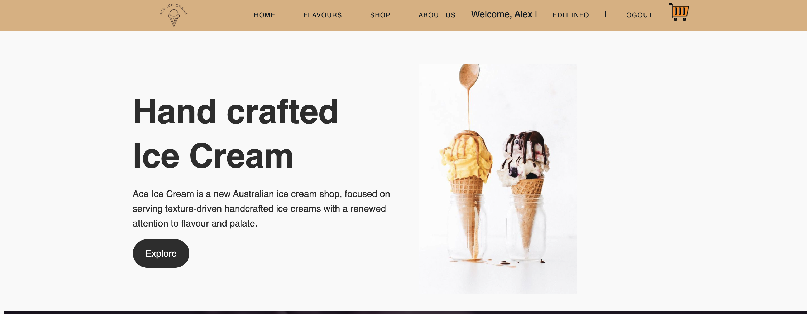
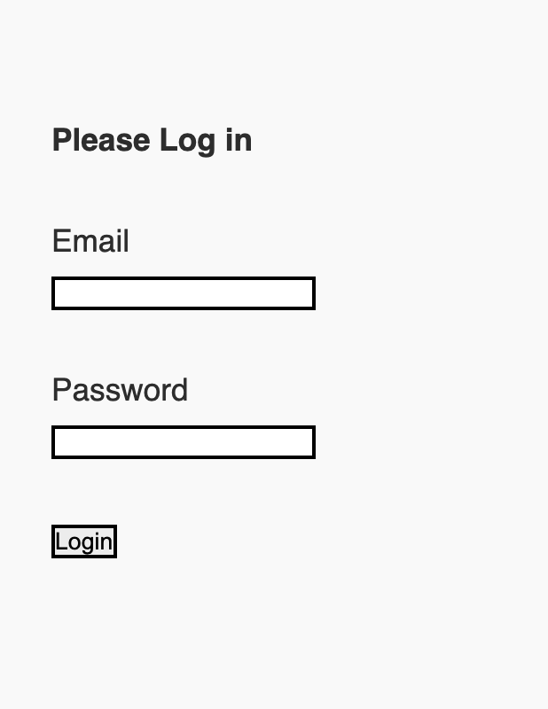
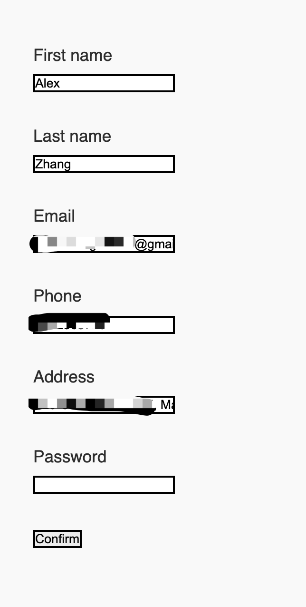
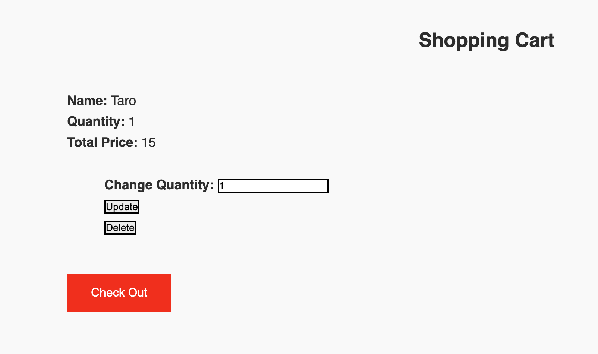
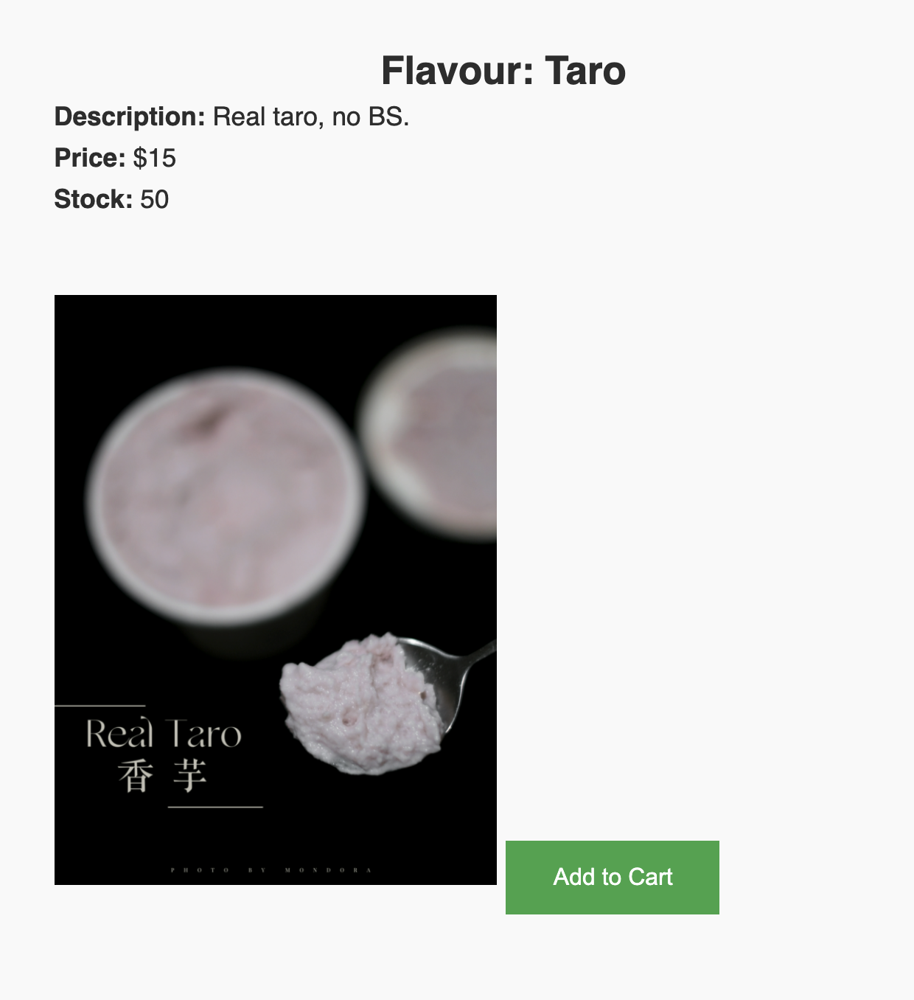

# Ace Ice Cream Website 
## This is a simple website that user can buy ice cream
This website allows users to: 
- Sign up their profile
- Update their info
- Log into/ Log out the website
- Add ice cream into the cart
- Update the quantity of a specific ice cream
- You can view this website by clicking [here]👈

## Tech

This project uses the following techs :

- Ruby on rails
There are 4 models used on this project including: `user`, `product`, `line_item`, and `cart`.
It Includes sign up/log in functionality, with encrypted passwords & an authorization flow./
The CRUD and MODEL-VIEW-CONTROLLER architecture is used. 

- CSS
- HTML

## Preview

This is the homepage, user can either click on the nav bar to browse the products or can click the Explore button at the hero section.

This is the Login and Sign up section, user can simply click to login or sign up

After logged in, this section will allow you to see the shopping cart or you can edit your information

If you want to add something to your cart before logging in, you will be asked to log in

This is Edit Information page, user can change their information and password.

This is shopping cart page, user can update the quantity, and the total price will be changed, , also user can delete any item

This is the page to show a specific ice cream, so user can add them to their cart
## Wishlist
- When user failed the email validation to sign up, show them a message, ( check email domain as well?)
- Password validation ( length, uppercase, special character)
- More CSS on Cart page and login + sign up page
- Link Strip with the website
- Generate pdf for tax invoice

   [here]:https://aceicecreamm.herokuapp.com
